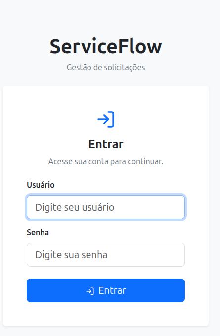

# ServiceFlow API

API REST para gerenciamento de chamados de suporte técnico, desenvolvida com **Java 21 e Spring Boot**, integrada a **PostgreSQL** e a um frontend em **React**.

O projeto foi desenvolvido de forma incremental, aplicando conceitos de desenvolvimento backend, arquitetura em camadas, persistência de dados, validação, tratamento de exceções, testes automatizados, autenticação com JWT, documentação com OpenAPI/Swagger, Docker, CI/CD e publicação em produção.



## Sobre o projeto

O **ServiceFlow** simula um sistema de gerenciamento de chamados de suporte técnico.

A aplicação permite registrar solicitações, consultar chamados, atualizar informações e controlar seus respectivos status, mantendo regras de negócio para preservar o histórico das solicitações.

O projeto também possui autenticação de usuários, proteção das rotas da API, frontend integrado ao backend e ambientes local e de produção.

### Objetivos

* Desenvolver uma API REST utilizando Java e Spring Boot.
* Trabalhar com persistência de dados utilizando JPA e PostgreSQL.
* Aplicar arquitetura em camadas.
* Implementar validações e regras de negócio.
* Criar testes automatizados.
* Implementar autenticação e autorização com JWT.
* Documentar a API com OpenAPI e Swagger UI.
* Containerizar a aplicação com Docker.
* Configurar integração contínua.
* Publicar a aplicação em produção.
* Integrar backend, frontend e banco de dados em um ambiente real.

---

## Funcionalidades

### Backend

* Cadastro de usuários.
* Autenticação com login e JWT.
* Criptografia de senhas com BCrypt.
* Criação de chamados.
* Consulta de chamados.
* Consulta de chamado por ID.
* Atualização de chamados.
* Alteração de status.
* Paginação.
* Ordenação.
* Validação de dados.
* Tratamento global de exceções.
* Regras de negócio para transição de status.
* Proteção das rotas da API.
* Persistência em PostgreSQL.
* Documentação com OpenAPI/Swagger.
* Logs e observabilidade básica.
* Testes unitários e de integração.

### Frontend

* Tela de login.
* Dashboard de chamados.
* Criação de novos chamados.
* Visualização dos chamados.
* Paginação.
* Contagem de chamados.
* Indicadores por status.
* Identificação visual dos diferentes status.
* Validação básica dos formulários.
* Tratamento de carregamento e erros.
* Autenticação utilizando JWT.
* Rotas protegidas.
* Logout.
* Redirecionamento para login quando a autenticação é inválida.
* Integração com a API utilizando Axios.

---

## Tecnologias

### Backend

* Java 21
* Spring Boot 4
* Spring Web MVC
* Spring Data JPA
* Spring Security
* Hibernate
* PostgreSQL
* Maven
* JUnit
* Mockito
* OpenAPI
* Swagger UI
* JWT
* BCrypt

### Frontend

* React
* Vite
* Axios
* Bootstrap
* React Bootstrap
* React Router
* Lucide React

### Infraestrutura e desenvolvimento

* Docker
* Docker Compose
* Git
* GitHub
* GitHub Actions
* Render
* Neon PostgreSQL

---

## Arquitetura

O backend utiliza uma arquitetura em camadas, separando responsabilidades entre os principais componentes da aplicação.

```text
Controller
    ↓
DTO
    ↓
Service
    ↓
Repository
    ↓
PostgreSQL
```

### Principais responsabilidades

* **Controller** — recebe as requisições HTTP e retorna as respostas.
* **DTO** — define os dados utilizados na entrada e saída da API.
* **Service** — concentra regras de negócio e operações da aplicação.
* **Repository** — realiza o acesso aos dados através do Spring Data JPA.
* **Entity** — representa as estruturas persistidas no banco.
* **Security** — concentra autenticação, JWT e proteção das rotas.
* **Exception** — centraliza o tratamento das exceções da API.

---

## Estrutura do projeto

```text
serviceflow-api/
├── frontend/
│   ├── public/
│   │   ├── favicon.svg
│   │   └── icons.svg
│   ├── src/
│   │   ├── assets/
│   │   │   ├── hero.png
│   │   │   ├── react.svg
│   │   │   └── vite.svg
│   │   ├── pages/
│   │   │   └── NewRequest.jsx
│   │   ├── services/
│   │   │   └── api.js
│   │   ├── App.css
│   │   ├── App.jsx
│   │   ├── index.css
│   │   └── main.jsx
│   ├── .gitignore
│   ├── .oxlintrc.json
│   ├── index.html
│   ├── package.json
│   ├── package-lock.json
│   ├── README.md
│   └── vite.config.js
├── src/
│   ├── main/
│   │   ├── java/
│   │   │   └── com/serviceflow/api/
│   │   │   │   ├── config/
│   │   │   │   │   ├── CorsConfig.java
│   │   │   │   │   ├── OpenApiConfig.java
│   │   │   │   │   └── SecurityConfig.java
│   │   │   │   │   ├── controller/
│   │   │   │   │   ├── AuthController.java
│   │   │   │   │   └── ServiceRequestController.java
│   │   │   │   ├── dto/
│   │   │   │   │   ├── LoginRequest.java
│   │   │   │   │   ├── LoginResponse.java
│   │   │   │   │   ├── RegisterRequest.java
│   │   │   │   │   ├── ServiceRequestRequest.java
│   │   │   │   │   ├── ServiceRequestResponse.java
│   │   │   │   │   └── ServiceRequestStatusRequest.java
│   │   │   │   ├── entity/
│   │   │   │   │   ├── ServiceRequest.java
│   │   │   │   │   ├── ServiceRequestStatus.java
│   │   │   │   │   └── User.java
│   │   │   │   ├── exception/
│   │   │   │   │   ├── ErrorResponse.java
│   │   │   │   │   ├── GlobalExceptionHandler.java
│   │   │   │   │   ├── InvalidServiceRequestStateException.java
│   │   │   │   │   └── ServiceRequestNotFoundException.java
│   │   │   │   ├── repository/
│   │   │   │   │   ├── ServiceRequestRepository.java
│   │   │   │   │   └── UserRepository.java
│   │   │   │   ├── security/
│   │   │   │   │   └── JwtAuthenticationFilter.java
│   │   │   │   └── service/
│   │   │   │   │   ├── AuthService.java
│   │   │   │   │   ├── CustomUserDetailsService.java
│   │   │   │   │   ├── JwtService.java
│   │   │   │   │   ├── ServiceflowApiApplication.java
│   │   │   │   │   └── ServiceRequestService.java
│   │   │   │   └── ServiceflowApiApplicationTests.java
│   │   └── resources/
│   │   │   ├── application.properties
│   │   │   └── application-dev.properties
│   └── test/
│   │   ├── java/
│   │   │   └── com/serviceflow/api/
│   │   │   │   ├── controller/
│   │   │   │   │   └── ServiceRequestControllerTest.java
│   │   │   │   ├── repository/
│   │   │   │   │   └── ServiceRequestRepositoryTest.java
│   │   │   │   ├── service/
│   │   │   │   │   └── ServiceRequestServiceTest.java
|   │   └── resources/
│   │   │   └── application-test.properties
├── .gitignore
├── .env.example
├── docker-compose.yml
├── Dockerfile
├── mvnw
├── pom.xml
├── README.md
└── serviceflow-preview.png
```

---

# Como executar localmente

## Pré-requisitos

Instale:

* Java 21
* Docker
* Docker Compose
* Node.js
* npm
* Git

---

## 1. Clonar o projeto

```bash
git clone https://github.com/lgomesroc/serviceflow-api.git
cd serviceflow-api
```

---

## 2. Configurar as variáveis de ambiente

Copie o arquivo de exemplo:

```bash
cp .env.example .env
```

O arquivo `.env.example` contém:

```env
DB_USERNAME=serviceflow
DB_PASSWORD=serviceflow_dev
JWT_SECRET=change-this-value
```

Gere uma chave para o JWT:

```bash
openssl rand -base64 32
```

Copie o resultado e substitua o valor de `JWT_SECRET` no arquivo `.env`.

O arquivo `.env` não deve ser versionado.

---

## 3. Inicializar o banco e a API

O projeto utiliza PostgreSQL em container Docker.

O `docker-compose.yml` utiliza um volume externo para preservar os dados do banco local. Em uma instalação nova, crie o volume definido no arquivo antes de iniciar os serviços.

Depois, execute:

```bash
docker-compose up -d --build
```

Verifique os containers:

```bash
docker-compose ps
```

Para acompanhar os logs da API:

```bash
docker-compose logs -f api
```

---

## 4. Inicializar o frontend

Abra outro terminal:

```bash
cd frontend
npm install
npm run dev
```

---

## Acessos locais

### Frontend

```text
http://localhost:5173
```

### API

```text
http://localhost:8080
```

### Swagger UI

```text
http://localhost:8080/swagger-ui/index.html
```

### OpenAPI

```text
http://localhost:8080/v3/api-docs
```

---

# Banco de dados

No ambiente local, o PostgreSQL é executado através do Docker Compose.

Configuração utilizada no ambiente de desenvolvimento:

```text
Database: serviceflow
Username: serviceflow
Password: serviceflow_dev
Host: localhost
Port: 5432
```

A aplicação utiliza JPA/Hibernate para persistência dos dados.

---

# Autenticação

A API utiliza **Spring Security e JWT** para autenticação.

Fluxo básico:

```text
Cadastro
   ↓
Usuário e senha
   ↓
Login
   ↓
JWT
   ↓
Requisições autenticadas
   ↓
Spring Security
   ↓
API protegida
```

As rotas protegidas exigem um token JWT válido.

O token é utilizado pelo frontend para realizar as requisições autenticadas à API.

---

# Regras de negócio

Os chamados possuem os seguintes status:

```text
PENDING
   ↓
IN_PROGRESS
   ↓
COMPLETED
```

Também é possível cancelar um chamado:

```text
PENDING ─────────→ CANCELLED
   │
   ↓
IN_PROGRESS ─────→ CANCELLED
```

### Regras importantes

* Um chamado em `PENDING` pode avançar para `IN_PROGRESS`.
* Um chamado em `IN_PROGRESS` pode ser finalizado como `COMPLETED`.
* Um chamado pode ser cancelado de acordo com as regras definidas pela aplicação.
* Estados finais não podem voltar para estados anteriores.
* Transições inválidas são rejeitadas pela API.
* Não existe operação de `DELETE` para chamados.
* O histórico das solicitações deve ser preservado.

---

# API

A API disponibiliza endpoints para:

| Recurso  | Operações                       |
| -------- | ------------------------------- |
| Usuários | Cadastro e autenticação         |
| Chamados | Criação, consulta e atualização |
| Status   | Alteração de status             |
| Consulta | Paginação e ordenação           |

A documentação completa dos endpoints está disponível através do Swagger UI.

### Local

```text
http://localhost:8080/swagger-ui/index.html
```

### Produção

```text
https://serviceflow-api-a9jk.onrender.com/swagger-ui/index.html
```

---

# Testes

O projeto possui uma suíte automatizada utilizando **JUnit e Mockito**.

Os testes cobrem diferentes partes da aplicação, incluindo:

* Controllers.
* Services.
* Regras de negócio.
* Validações.
* Exceções.
* Autenticação.
* Segurança.
* Integração com a persistência.

Executar os testes:

```bash
./mvnw test
```

Executar limpeza, testes e gerar o `.jar`:

```bash
./mvnw clean package
```

O artefato gerado fica em:

```text
target/serviceflow-api-0.0.1-SNAPSHOT.jar
```

---

# Build do frontend

Dentro da pasta `frontend`:

```bash
npm run build
```

O build de produção é gerado em:

```text
frontend/dist/
```

---

# Docker

A aplicação backend possui um `Dockerfile` para geração da imagem da API.

O ambiente local pode ser iniciado através do Docker Compose:

```bash
docker-compose up -d --build
```

Parar os serviços:

```bash
docker-compose down
```

Ver os logs:

```bash
docker-compose logs -f
```

---

# CI/CD

O projeto utiliza **GitHub Actions** para integração contínua.

A cada Pull Request direcionado para a branch `main`, o pipeline executa o processo de validação do backend, incluindo:

* Configuração do Java 21.
* Inicialização de um PostgreSQL temporário.
* Execução dos testes automatizados.
* Build da aplicação.
* Geração do artefato.

A branch `main` é protegida, evitando alterações diretas.

O fluxo utilizado no desenvolvimento é:

```text
Branch de desenvolvimento
        ↓
Pull Request
        ↓
GitHub Actions
        ↓
Testes + Build
        ↓
Merge na main
        ↓
Render
        ↓
Deploy em produção
```

O deploy da aplicação publicada é realizado pelo Render após as alterações serem integradas à branch principal.

---

# Produção

O projeto está publicado em produção.

### Frontend

```text
https://serviceflow-frontend-bmyj.onrender.com
```

### API

```text
https://serviceflow-api-a9jk.onrender.com
```

### Swagger

```text
https://serviceflow-api-a9jk.onrender.com/swagger-ui/index.html
```

### Banco de dados

O ambiente de produção utiliza PostgreSQL hospedado no **Neon**.

A API e o frontend são executados no **Render**.

No plano gratuito do Render, o serviço pode apresentar uma latência inicial após períodos de inatividade devido ao comportamento de suspensão do ambiente.

---

# Desenvolvimento

O projeto foi construído de forma incremental em **25 etapas**, abrangendo desde a criação da API até sua publicação em produção.

* **Aulas 1–5** — Estrutura inicial, PostgreSQL, JPA, entidades, repositories, services, controllers e endpoints REST.
* **Aulas 6–9** — Tratamento de exceções, validações e testes automatizados.
* **Aulas 10–12** — DTOs, mapeamento e organização da arquitetura em camadas.
* **Aulas 13–14** — Alteração de status e implementação das regras de negócio.
* **Aulas 15–17** — OpenAPI/Swagger, paginação, ordenação e ampliação da cobertura de testes.
* **Aulas 18–20** — Perfis de ambiente, variáveis de ambiente, Docker e Docker Compose.
* **Aula 21** — Logs e observabilidade básica.
* **Aula 22** — Desenvolvimento e integração do frontend React.
* **Aulas 23–24** — Spring Security, autenticação, JWT, login e proteção das rotas.
* **Aula 25** — Revisão final, validação local e em produção e preparação do projeto para portfólio.

---

# Status

**Projeto funcional e publicado em produção.**

O projeto possui:

* Backend Java/Spring Boot.
* Frontend React.
* PostgreSQL.
* Autenticação JWT.
* Regras de negócio.
* Testes automatizados.
* Swagger/OpenAPI.
* Docker.
* CI com GitHub Actions.
* Deploy em produção.
* Integração entre frontend, backend e banco de dados.

Última validação da aplicação:

```text
Testes automatizados: 48
Falhas: 0
Erros: 0
```

---

# Autor

**Luciano Gomes**

Desenvolvedor focado em backend e desenvolvimento de aplicações web.

GitHub:

```text
https://github.com/lgomesroc
```

---

# Licença

Este projeto está disponível para fins de estudo, portfólio e demonstração de conhecimentos em desenvolvimento de software.

